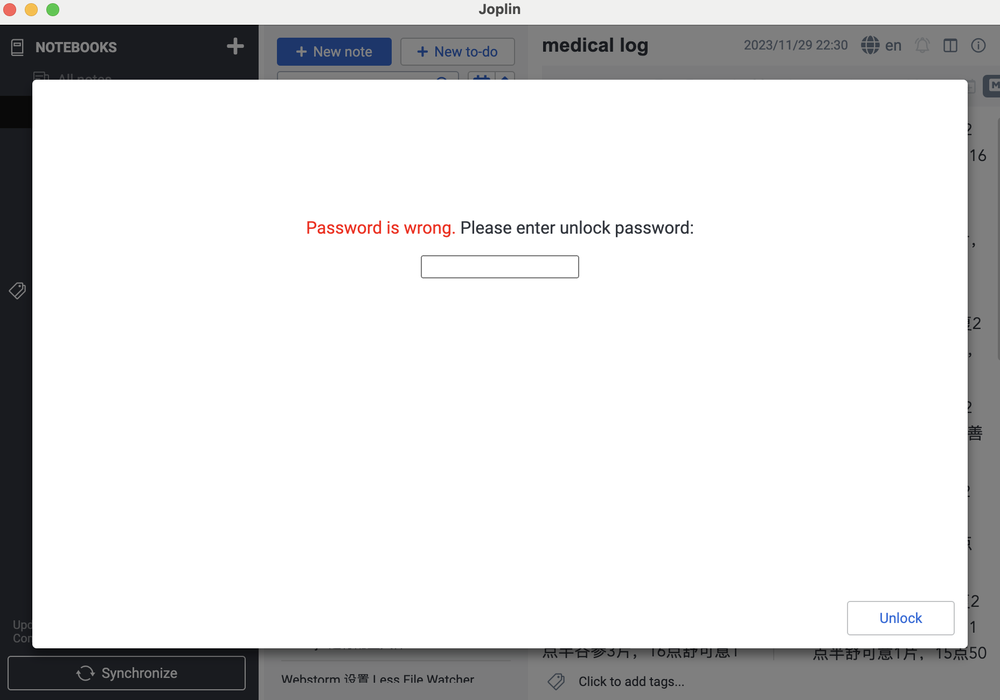
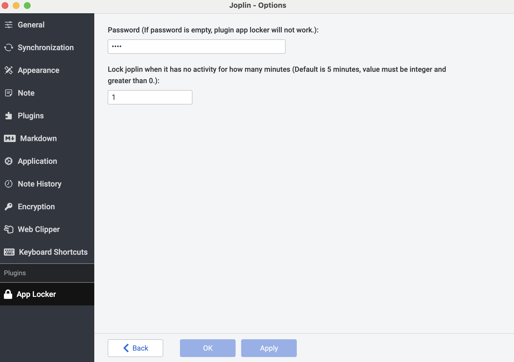

# joplin-plugin-screen-locker

A joplin plugin which will lock screen of joplin app when it is idle, which can prevent others view your note or your screen directly.

**Please note** 

This plugin can't encrypt your note data, if you want to encrypt your data on cloud, please enable the setting of End-to-end encryption.

For more joplin plugins, please see [here](https://github.com/joplin/plugins).

## Screenshots

## How to use this plugin?

First go to setting, fill app lock password. Then fill when joplin is idle for how many minutes, then lock the app screen.

## QA

* If it's not working, please restart jopin app.
* If it's not working after restarted, please submit an issue.
